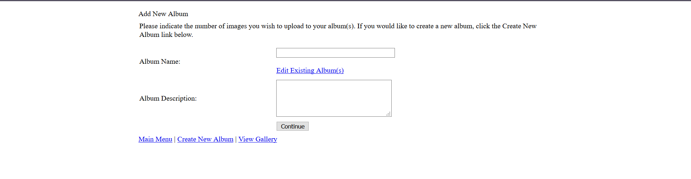
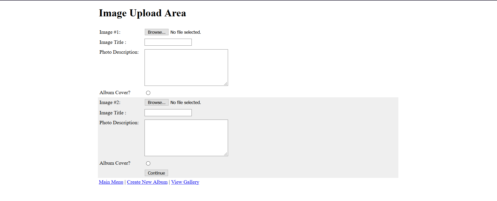

# PHP-Online-Album
An online photo album interface where the user can create an album and upload multiple photos.

## Prerequsites

* PHPv5 and above
* Any local server for testing

## Testing Procedure

1. Create a database with name `album`
2. Create two tables `albums` and `photos`. The sql query has been provided in *mysql_table_initiator.txt*
3. Create a folder named `include`.
4. Create a php file `config.php` with its content being:

```php
<?php
     // Include file for database connectivity
     $db_server = "localhost";
     $db_user = "root";
     $db_pass = "";
     $db_name = "album";
     // Number of images to display per row in gallery view     
     DEFINE("IMAGE_DISPLAY", 3);
     /*****
      * Connects to database system
      */
     function db_connect(){
         global $db_server;
         global $db_user;
         global $db_pass;
         global $db_name;
         $dbcnx = mysqli_connect($db_server, $db_user, $db_pass) or die("Error connecting to database: " . mysqli_error($dbcnx));
         $dbsel = mysqli_select_db($dbcnx ,$db_name) or die("Error reading from database table: " . mysqli_error($dbcnx));
         return $dbcnx;
     }
  /*****
   * Displays HTML output page.  The message argument, if passed, 
   * will be displayed to the user.  The title element, is passed,                    
   * replaces the page title, and the cell Boolean places the page 
   * $msg between <td></td>
   */  
   function displayPage($msg = "", $title="", $cell = true){
?>
 <!DOCTYPE HTML PUBLIC "-//W3C//DTD HTML 4.01 Transitional//EN">
 <html>
 <head>
 <title><?php echo($title); ?></title>
 <meta http-equiv="Content-Type" content="text/html; charset=iso-8859-1">
 </head>
 <body leftmargin="0" topmargin="0" marginwidth="0" marginheight="0">
 <table width="100%" border="0" cellpadding="0" cellspacing="0">
   <tr>
  <td>
   <table width="60%" border="0" align="center" cellpadding="3" cellspacing="0">
     <tr>
    <td width="40%" valign="top"><h1><?php echo($title); ?></h1></td>
     </tr>
   </table>
   <table width="60%" border="0" align="center" cellpadding="5" cellspacing="0">
   <tr>
    <?php
     // Display opening <td> tag
     if ($cell)
      echo("<td>");
     echo($msg);
     
     // Display closing <td> tag
     if ($cell)
      echo("</td>");   
    ?>
   </tr>
   </table>
  </td>
   </tr>
 </table>
 </body>
<?php
  }       
?>
```
*The above code will link all the mysql queries with the database at every stage.*

## Screenshots

1. Main Menu


2. Adding an Album



3. Adding IMAGES




